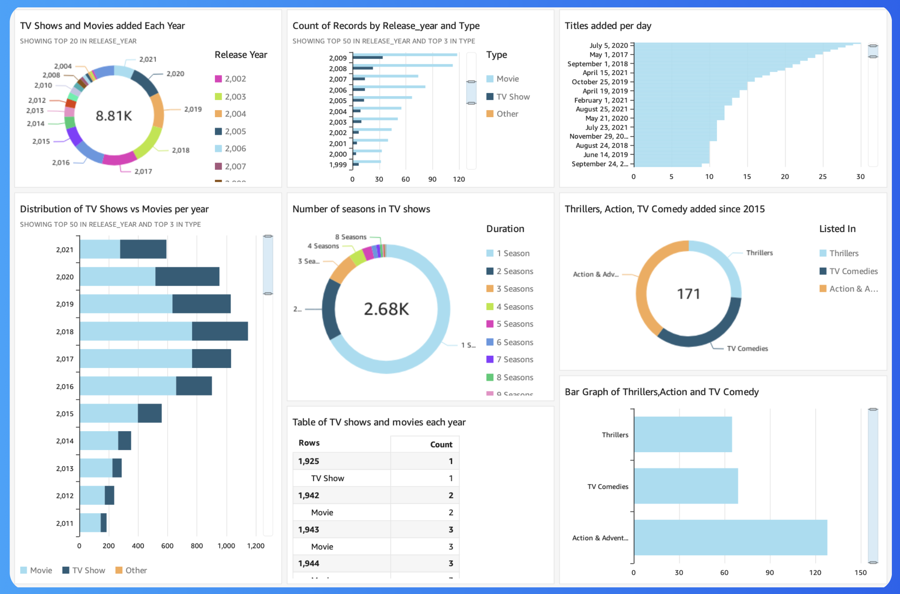

# Netflix Titles Analysis with Amazon QuickSight

## Overview

This project presents an analysis of Netflix titles using Amazon QuickSight, AWS's cloud-based business intelligence service. With QuickSight, we can create, interact, and share visual insights from large datasets, making it a powerful tool for generating business insights. In this project, we leveraged QuickSight to analyze and visualize key metrics from Netflix’s extensive library of content.

The dataset used for this analysis was stored in Amazon S3, ensuring scalability and reliability for our data storage needs. The visualizations offer a deeper understanding of trends, such as the growth in content, differences in types of content added over time, and genre-specific distributions.

Due to additional costs associated with hosting dashboards on Amazon QuickSight, the interactive dashboard is not available here. However, we provide an image of the completed dashboard to give you a visual idea of the analysis.

## Project Details

### What is Amazon QuickSight?

Amazon QuickSight is a scalable, cloud-powered business intelligence (BI) tool offered by AWS. It allows users to create interactive dashboards, visualizations, and reports, making it easy to gain insights from data. This tool integrates seamlessly with other AWS services such as S3, allowing for smooth data retrieval and visualization.

### Dataset Description

The project utilized Netflix titles data stored in an Amazon S3 bucket. The dataset includes fields such as:

- **Title**
- **Type (Movie or TV Show)**
- **Release Year**
- **Genres**
- **Country of Origin**

The data was imported into QuickSight from S3, with a manifest file helping in specifying the data import process and organization.

### Project Workflow

- **Data Upload**: We used AWS S3 to store the dataset. Two files, `netflix.csv` and `manifest.json`, were stored in an S3 bucket. The manifest file played a critical role in enabling the correct import of the dataset into Amazon QuickSight.

- **QuickSight Setup**: We used the free trial version of Amazon QuickSight to build the visualizations. This required setting up a QuickSight account and configuring access to the S3 bucket to import the Netflix data.

- **Data Import**: The dataset was imported from the S3 bucket, and relevant fields were used to generate visualizations.

## Dashboard Preview

## Visualizations and Insights

Amazon QuickSight was used to create multiple visualizations to better understand Netflix's content growth. Here are some of the key visualizations created:

- **Donut Chart**: A donut chart was created to visualize the total number of movies and TV shows added to Netflix each year. This helps to understand the overall growth and patterns in the addition of new content.

- **Bar Chart**: We created a bar chart to compare the number of movies and TV shows released each year. This comparison gives insight into Netflix’s strategy in terms of balancing different content types.

- **Genre Analysis**: Filtering and grouping were used to focus on particular genres such as Thrillers, Comedy, and Action. These visualizations provided insights into the genre preferences of Netflix over time, especially after 2015.

## Dashboard Overview

The final dashboard was set up to be concise and visually appealing. It included:

- **Key Metrics**: Overview of movies vs. TV shows.

- **Trend Insights**: Yearly additions to the Netflix library.

- **Genre Specific Analysis**: Breakdown of genres added after 2015.

We also leveraged QuickSight's ability to filter data dynamically, which allowed us to focus only on the facts and numbers that were relevant, abstracting away unnecessary information.

The dashboard was designed to be easy to understand and visually communicative without requiring a deep understanding of the entire dataset. While the fully interactive dashboard is not available, an image of the final version has been provided to help illustrate the project’s outcome.

## Challenges and Learnings

One of the challenges was setting up and understanding the cost implications of using Amazon QuickSight, as it is a paid service. Nonetheless, the trial version offered enough functionality for our analysis needs. Additionally, setting up AWS S3 storage and editing the manifest.json to properly link data sources were crucial steps in ensuring a smooth import process.

The usability of Amazon QuickSight stood out during this project. The ease of data visualization, drag-and-drop capabilities, and simple integration with AWS S3 made it efficient to transform data into meaningful insights.

## Costs and Limitations

- **Amazon QuickSight** is a paid service, with costs of around $9-$12 per user per month. We used a free trial version for this project.

- Due to the cost of hosting dashboards interactively, **the published QuickSight dashboard is not included in this repository**. Instead, we have provided an image that gives a preview of the visual insights we developed.
